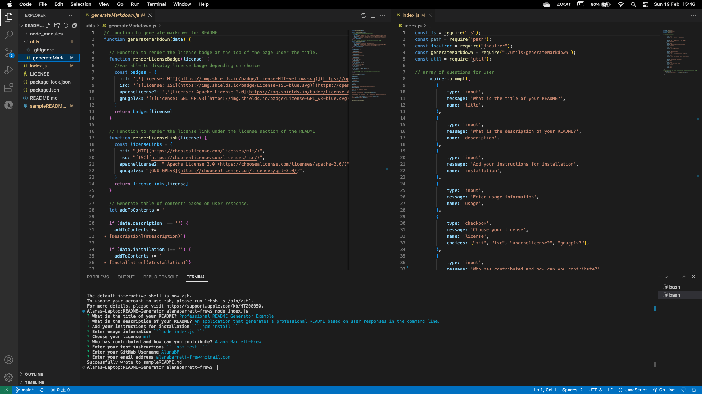

# README-Generator
README Generator so that you can quickly create a professional README for a new project by answering question in the terminal running node index.js

[](https://opensource.org/licenses/MIT)

## Table of Contents

* [Description](#Description)
* [Installation](#Installation)
* [Usage](#Usage)
* [License](#License)
* [Questions](#Questions)

## Description
When creating an open source project on GitHub, it’s important to have a high-quality README for the app. This should include what the app is for, how to use the app, how to install it, how to report issues, and how to make contributions—this last part increases the likelihood that other developers will contribute to the success of the project.

You can quickly and easily create a README file by using a command-line application to generate one. This allows the project creator to devote more time to working on the project.

* As a developer, I want a README generator so that I can quickly create a professional README for a new project

https://github.com/AlanaBF/README-Generator 

## Installation
In order to run this application, run the following in the command line:

```bash
npm install
```

## Usage
Run the following in the command line
```bash
node index.js
```


 

* When a user is prompted for information about the application repository then a high-quality, professional README.md is generated with:
    * The title of the project 
    * Sections entitled:
      * Description 
      * Table of Contents 
      * Installation 
      * Usage 
      * License (Badges created by https://shields.io/)
      * Contributing 
      * Tests 
      * Questions
    * When a user enters the project title then it is displayed as the title of the README
    * When a user enters a description, installation instructions, usage information, contribution guidelines, and test instructions then this information is added to the sections of the README entitled Description, Installation, Usage, Contributing, and Tests
    * When a user chooses a license for their application from a list of options then a badge for that license is added near the top of the README and a notice is added to the section of the README entitled **License** that explains which license the application is covered under
    * When a user enters their GitHub username then this is added to the section of the README entitled Questions, with a link to their GitHub profile
    * When a user enters their email address then this is added to the section of the README entitled Questions, with instructions on how to reach them with additional questions
    * When a user clicks on the links in the **Table of Contents** then they are taken to the corresponding section of the README

## License
*This project is licensed under* [MIT](https://choosealicense.com/licenses/mit/)

## Questions
*Contact me if you have any questions or need to report a problem. Alternatively open an issue.*

Find me on GitHub: [AlanaBF](https://github.com/AlanaBF)

Email: [alanabarrett-frew@hotmail.com](mailto:alanabarrett-frew@hotmail.com)
